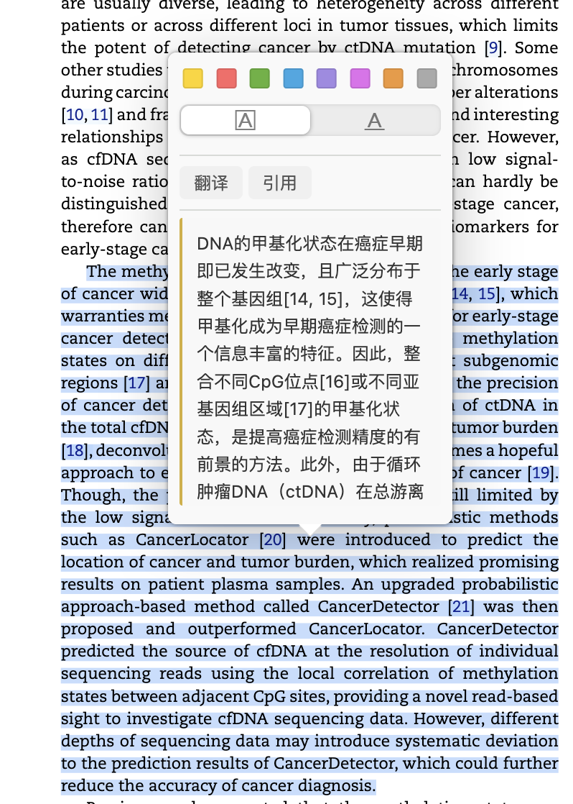
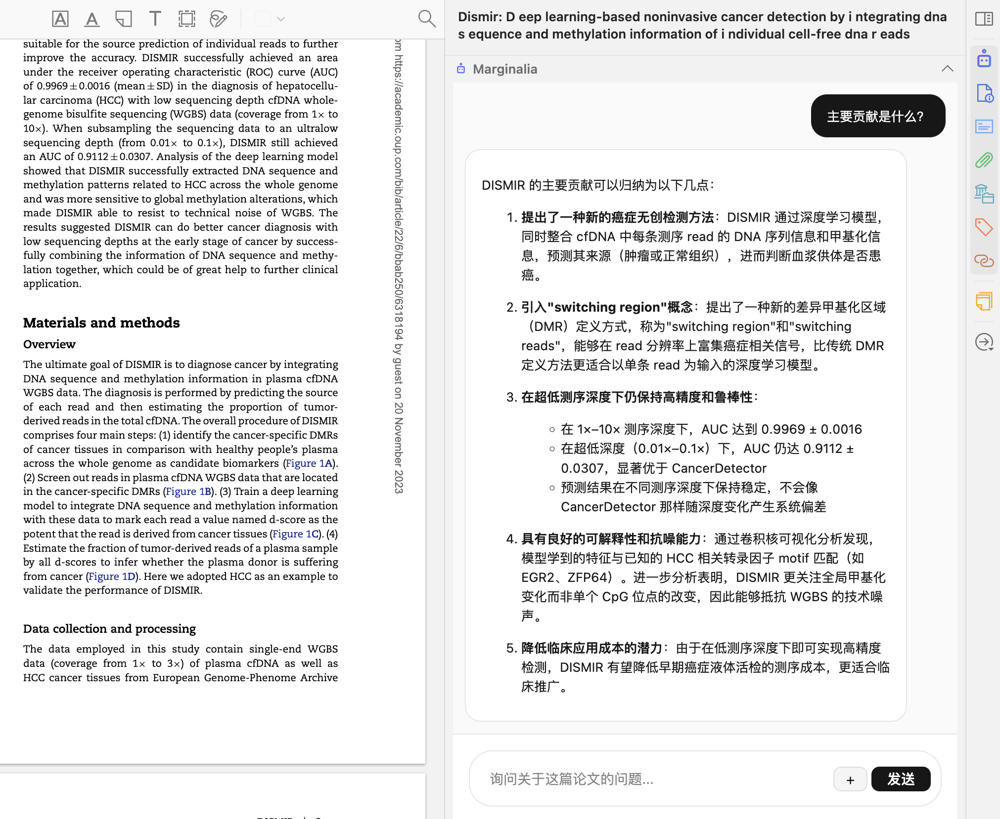

# Marginalia ✨

Marginalia 是一个为 Zotero 7 设计的 AI 阅读助手，帮助你更高效地阅读、翻译和理解学术论文。

## 🎯 功能一览

### 📖 划词翻译

在 PDF 阅读器中选中文字，即可一键翻译为中文，翻译结果直接显示在弹窗中，无需离开阅读界面。

### 💬 AI 论文对话

在侧边栏与 AI 进行基于论文全文的智能对话，支持流式响应，实时查看 AI 回复。

- 自动加载论文标题、作者、摘要和全文作为上下文
- 对话历史按论文自动保存，随时回顾
- 快捷提问按钮：总结论文、主要贡献、研究方法、局限性
- Markdown 渲染：代码块、列表、链接等格式完美呈现

### 📌 引用提问

选中论文中的关键段落，点击「引用」按钮收集到侧边栏，然后针对引用内容向 AI 提问。

- 支持多段引用，以 chip 形式展示在输入框上方
- 引用内容作为独立上下文传递给 AI，回答更精准
- 点击引用自动打开侧边栏并定位到插件面板

### 🗂️ 对话管理

- 📄 导出对话历史为 Markdown 文件
- 🗑️ 清除单篇论文的对话历史
- 📋 单条消息一键复制
- 🔄 对话轮数限制（可配置，避免上下文过长）

## 📦 安装

1. 下载最新版本的 `.xpi` 文件
2. 在 Zotero 中打开 `工具` → `插件`
3. 点击右上角齿轮图标，选择 `Install Add-on From File...`
4. 选择下载的 `.xpi` 文件

## ⚙️ 配置

安装后，进入 `编辑` → `首选项` → `Marginalia` 进行配置：

### API 设置

| 配置项 | 说明 | 示例 |
|--------|------|------|
| API URL | OpenAI 兼容的 API 端点 | `https://api.openai.com/v1` |
| API Key | 你的 API 密钥 | `sk-...` |
| 模型 | 使用的模型名称 | `gpt-4o`、`claude-sonnet-4-20250514` |

### 对话设置

| 配置项 | 说明 | 默认值 |
|--------|------|--------|
| 系统提示词 | 自定义 AI 的行为和角色 | 学术论文分析助手 |
| 最大对话轮数 | 限制保存的对话历史长度 | 20（0 = 不限制） |

## 🚀 使用方法

1. 在 Zotero 中选择一篇论文，打开 PDF 阅读器
2. 在右侧面板找到 Marginalia 标签
3. 直接输入问题，或使用快捷提问按钮开始对话
4. 选中 PDF 中的文字，使用「翻译」或「引用」功能

## 📄 许可证

AGPL-3.0-or-later

## 🙏 致谢

本项目基于 [Zotero Plugin Template](https://github.com/windingwind/zotero-plugin-template) 开发。
